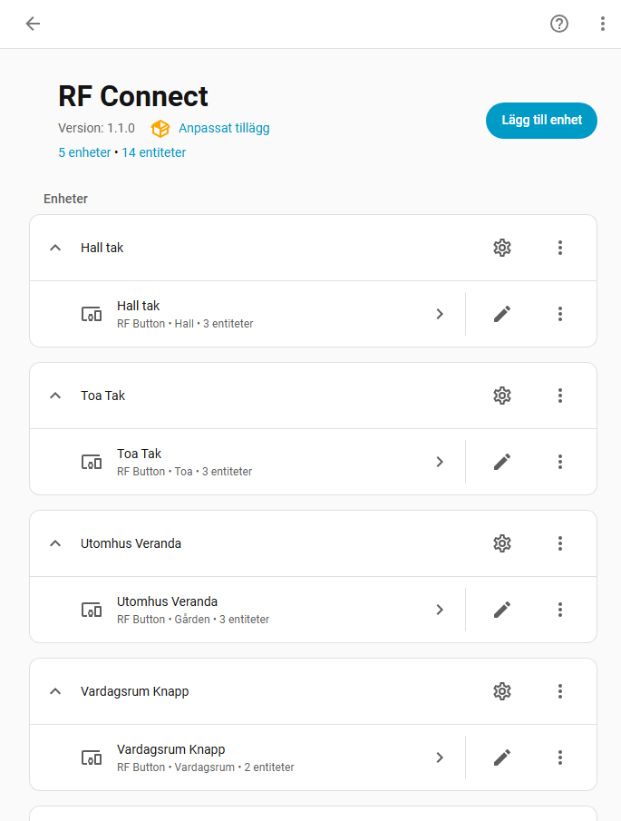
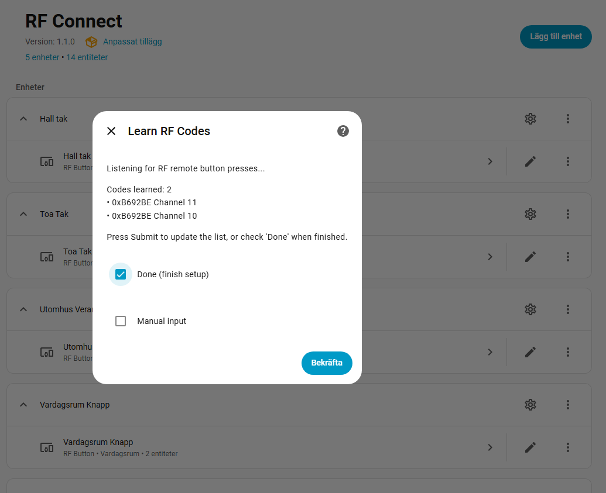
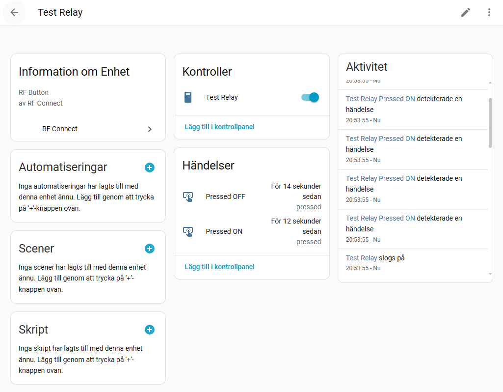
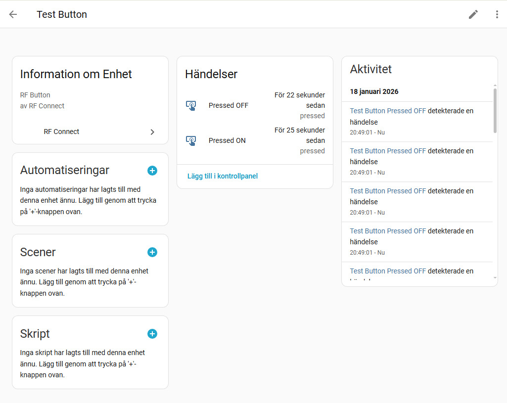

# RF Connect - Home Assistant Integration

A simple, modular Home Assistant integration for managing 433.92 MHz RF devices via ESPHome and CC1101 transceiver.



## Features

- **Device-Centric Design**: Each relay or button is a separate device in Home Assistant
- **Two Device Types**:
  - **Relays**: Switch entities that control RF relays
  - **Buttons**: Event-based entities for automation triggers
- **Multiple RF Codes**: Support for multiple transmitters controlling the same relay
- **Easy Configuration**: UI-based setup with RF code learning
- **Modular Management**: Add, remove, or delete devices and RF codes via UI

## Requirements

- Home Assistant 2023.1 or newer
- ESPHome device with CC1101 transceiver
- ESPHome service: `esphome.esphomerf_rf_code_send`
- ESPHome event: `esphome.rf_code_received`

## Installation

1. Copy the `custom_components/rfconnect` folder to your Home Assistant `config/custom_components/` directory
2. Restart Home Assistant
3. Go to **Settings** → **Devices & Services**
4. Click **Add Integration** and search for **RF Connect**

## Setup

### Adding a Device

1. Go to **Settings** → **Devices & Services** → **Add Integration**
2. Search for **RF Connect**
3. Enter your ESPHome entity ID (e.g., `esphome.esphomeRF`)

### Configure Device

1. Enter a **Device Name** (e.g., "Living Room Light")
2. Select **Device Type**:
   - **RF Relay (Switch)** - For controllable RF switches/relays
   - **RF Button (Event)** - For RF buttons that trigger automations

### Learn RF Codes

The integration will listen for RF codes from your remote:



1. **Press buttons on your RF remote** - The integration captures the codes automatically
2. **Click Submit** to update the code count and see what's been learned
3. **Toggle buttons ON/OFF** to add or remove codes from the list
4. **Click Done** when you've learned all the codes you need

**Note**: Only codes left in the ON state will be saved!

Alternatively, click **Manual input** if you know the device ID and channel values.

## Usage

### Relays (Switches)



- Control via Home Assistant UI
- Use in automations:
  ```yaml
  service: switch.turn_on
  target:
    entity_id: switch.garage_light
  ```
- State updates automatically when RF code is received

### Buttons (Events)



- Use as automation triggers:
  ```yaml
  trigger:
    - platform: event
      event_type: rfconnect_button_pressed
      event_data:
        entry_id: <your_entry_id>
        button_type: "on"
  ```
- Or use the event entity directly in automations

## Managing Devices

### Add Additional RF Codes
If you have multiple remotes controlling the same device:

1. Go to the device in **Devices & Services**
2. Click **Configure**
3. Select **Add RF Code**
4. Enter the new `device_id` and `channel`
5. Select state type (on/off)

### Remove RF Codes
1. Click **Configure** on the device
2. Select **Remove RF Code**
3. Choose the code to remove

### Delete Device
1. Click **Configure** on the device
2. Select **Delete Device**
3. Confirm deletion

## ESPHome Configuration

Your ESPHome device should:

1. **Send RF codes** via service `esphome.esphomerf_rf_code_send` with parameters:
   - `device`: Integer (e.g., 11965118 from hex 0xB692BE)
   - `channel`: Integer
   - `state`: Integer (0 or 1)
   - `level`: Integer (0 for no dimming)

2. **Receive RF codes** and fire event `esphome.rf_code_received` with data:
   - `device`: Hexadecimal string (e.g., "0xB692BE")
   - `channel`: Integer
   - `state`: Integer (0 or 1)
   - `group`: Boolean
   - `level`: Integer

### Example ESPHome Configuration (D1 Mini + CC1101)

```yaml
esphome:
  name: esphomerf
  friendly_name: espHomeRF

esp8266:
  board: d1_mini

logger:
  level: DEBUG

api:
  encryption:
    key: !secret api_key
  services:
    - service: rf_code_send
      variables:
        device: int
        channel: int
        state: bool
        level: int
      then:
        - script.execute:
            id: rf_tx
            device: !lambda "return device;"
            channel: !lambda "return channel;"
            state: !lambda "return state;"
            level: !lambda "return level;"

ota:
  - platform: esphome
    password: !secret ota_password

wifi:
  ssid: !secret wifi_ssid
  password: !secret wifi_password
  fast_connect: true
  ap:
    ssid: "Esphomerf Fallback Hotspot"
    password: !secret wifi_password

spi:
  clk_pin: D5
  miso_pin: D6
  mosi_pin: D7

cc1101:
  id: cc1101_1
  cs_pin: D4
  frequency: 433.92MHz
  modulation_type: ASK/OOK
  filter_bandwidth: 203kHz

remote_receiver:
  id: rf_rx
  pin: D1          # CC1101 GDO2
  dump: nexa
  tolerance: 60%
  filter: 80us
  idle: 10ms
  on_nexa:
    then:
      - homeassistant.event:
          event: esphome.rf_code_received
          data:
            device: !lambda |-
              char buf[11];
              sprintf(buf, "0x%06X", x.device);
              return std::string(buf);
            channel: !lambda "return x.channel;"
            group: !lambda "return x.group;"
            state: !lambda "return x.state;"
            level: !lambda "return x.level;"

remote_transmitter:
  pin: D2          # CC1101 GDO0
  carrier_duty_percent: 100%

script:
  - id: rf_tx
    mode: queued
    parameters:
      device: int
      channel: int
      state: bool
      level: int
    then:
      - lambda: |-
          ESP_LOGI("rf_tx", "TX start dev=%d ch=%d state=%d level=%d",
                   device, channel, (int)state, level);
          id(cc1101_1).set_idle(); 
          
      - cc1101.begin_tx
      - delay: 5ms

      - remote_transmitter.transmit_nexa:
          device: !lambda "return device;"
          channel: !lambda "return channel;"
          group: false
          state: !lambda "return state;"
          level: !lambda "return level;"
          repeat:
            times: 6
            wait_time: 15ms

      - cc1101.begin_rx

      - lambda: |-
          ESP_LOGI("nexa_tx", "TX done -> back to RX");
```

### Pin Connections (D1 Mini + CC1101)
```
CC1101  →  D1 Mini
VCC     →  3.3V
GND     →  GND
SCK     →  D5 (GPIO14)
MISO    →  D6 (GPIO12)
MOSI    →  D7 (GPIO13)
CS      →  D4 (GPIO2)
GDO0    →  D2 (GPIO4)  - TX pin
GDO2    →  D1 (GPIO5)  - RX pin
```

## Troubleshooting

### RF Codes Not Received
1. Check ESPHome logs for incoming RF signals
2. Verify event name is `esphome.rf_code_received`
3. Check device_id format (should include "0x" prefix)

### Switch Not Responding
1. Verify ESPHome service name: `esphome.esphomerf_rf_code_send`
2. Check Home Assistant logs for service call errors
3. Ensure RF codes are correctly configured

## Architecture

### File Structure
```
custom_components/rfconnect/
├── __init__.py          # Integration setup
├── config_flow.py       # UI configuration
├── const.py             # Constants
├── event.py             # Button event platform
├── manifest.json        # Integration metadata
├── storage.py           # Storage handler
├── strings.json         # UI strings
├── switch.py            # Relay switch platform
└── translations/
    └── en.json          # English translations
```

### Device Structure
Each device (relay or button) creates:
- One device entry in Home Assistant
- One or more entities:
  - **Relay**: `switch.<device_name>`
  - **Button**: `event.<device_name>_pressed_on`, `event.<device_name>_pressed_off`

### Data Storage
- RF codes stored in `.storage/rfconnect_devices`
- Config entries managed by Home Assistant

## Examples

### Automation: Toggle Light with Button
```yaml
automation:
  - alias: "Bedroom Button Controls Light"
    trigger:
      - platform: event
        event_type: rfconnect_button_pressed
        event_data:
          button_type: "on"
    action:
      - service: light.turn_on
        target:
          entity_id: light.bedroom
```

### Script: Send RF Command
```yaml
script:
  garage_door_open:
    sequence:
      - service: switch.turn_on
        target:
          entity_id: switch.garage_door
```

## Support

For issues, feature requests, or questions:
- GitHub Issues: [Create an issue](https://github.com/hubb3/rfconnect/issues)
- Home Assistant Community: [Forum thread](https://community.home-assistant.io/)

## Credits

Built for managing RF 433.92 MHz devices with ESPHome and Home Assistant.
